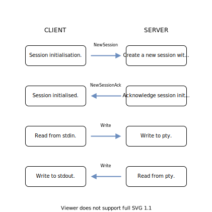

# Jaw: the remote shell

Jaw is a remote shell that uses UDP as a transport protocol.

It is currently just a proof-of-concept, and a result of my play with UDP.

# Flow

# Features

- [x] Running remote shell over UDP.
- [x] Multiple session support.
- [x] True color support.
- [ ] NAT hole punching 
- [ ] IP address change on the fly.
- [ ] Encryption.
- [ ] Authentication.
- [ ] Local echo.
- [ ] Adjustable frame rate.
- [ ] Deleting old sessions.
- [ ] Performance comparsion to SSH.
